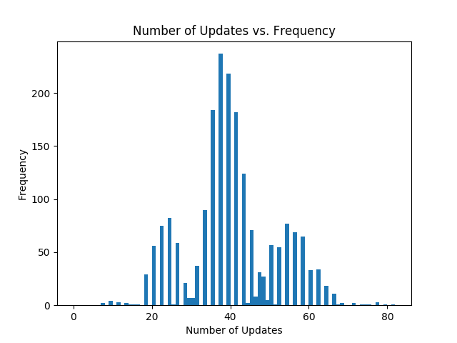

# README for problem 8

學號：b04902053 姓名：鄭淵仁

## Requirements

```
python3
numpy
matplotlib
```

## Usage

```shell
python3 8.py [data set] [output png]
```

For example,

```shell
python3 8.py hw1_8_train.dat output.png
```

## Output image

The output file would be like this:


